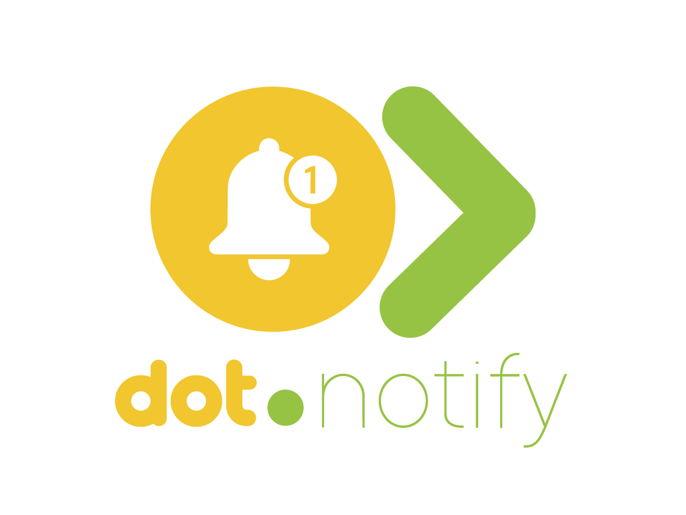

<div align="center">



<br /><br />

**Send, track, and optimise notifications across email, SMS, push, and Slack.**

<br />

   

<br /><br />

**Part of the [InfoDot Ecosystem](https://github.com/sakhileb/InfoDot)** &nbsp;·&nbsp; `notify.infodot.app`

</div>

---

## What is Dot.Notify?

Dot.Notify is the notification management platform in the InfoDot ecosystem. Teams configure delivery channels, build message templates with AI assistance, set event-triggered routing rules, and track every notification's journey from queue to delivery — with full analytics on open and click rates.

## Core Features

- Multi-channel delivery — email, SMS, push, webhook, Slack, and in-app
- Template builder with {{ variable }} interpolation
- AI template generation — describe the notification, get copy in seconds (falls back to a deterministic stub if no API key is configured)
- Rule engine model (`NotifyRule`) mapping trigger events to a channel + template — no management UI yet, see Roadmap
- Delivery log — full audit trail with status per recipient, searchable by recipient/subject and filterable by status
- User preference management — opt-in/out per notification type
- Bulk batch sends with delivery rate tracking
- Auto-generated webhook endpoint tokens (`NotifyWebhook`) — the receiving HTTP endpoint itself is not implemented yet, see Roadmap
- In-app self-notifications for this platform's own operators (channel degraded, batch failed)
- Ecosystem SSO from InfoDot hub

## Domain Models

- **NotifyChannel** — configured delivery channel (email, SMS, etc.)
- **NotifyTemplate** — message template with variable support
- **NotifyRule** — trigger-to-channel routing rule
- **NotifyLog** — delivery audit record per recipient
- **NotifyPreference** — per-user opt-in/out by notification type + channel
- **NotifyBatch** — bulk send with progress/delivery-rate tracking
- **NotifyWebhook** — inbound webhook endpoint registration (token generation only; no receiving route yet)

> A `notify_schedules` table exists in the schema for recurring/cron-based sends, but there is no `NotifySchedule` model or UI built on it yet.

## Roadmap / Known Gaps

- Inbound webhook receiving endpoint (route + signature verification) — not implemented; `NotifyWebhook` currently only issues tokens
- `NotifyRule` management UI (the model and relationships exist, no Livewire component yet)
- `NotifySchedule` model + recurring-send execution (table exists, unused)
- Knowledge Pack publishing to Dot.Brain (`observation`/`insight`/`outcome`/`incident`) — see `wiki.md` for the target shape

## Tech Stack

| Layer | Technology |
|---|---|
| Framework | Laravel 12 |
| Language | PHP 8.4 |
| Frontend | Livewire 3 · Alpine.js 3 · Tailwind CSS |
| Database | PostgreSQL 16 (shared across ecosystem) |
| Realtime | Laravel Reverb |
| Auth | Laravel Sanctum (InfoDot SSO) |
| AI | Anthropic Claude (`claude-sonnet-4-6`) |
| Storage | AWS S3 / Local (Flysystem) |
| Search | Laravel Scout · Meilisearch |
| Queue | Redis · Laravel Horizon |

## Quick Start

```bash
git clone https://github.com/sakhileb/Dot.Notify.git
cd Dot.Notify
cp .env.example .env
composer install
npm install && npm run build
php artisan key:generate
php artisan migrate
php artisan serve
```

> **Ecosystem SSO:** Set `DB_*` env vars to the shared InfoDot PostgreSQL instance and `APP_URL=https://notify.infodot.app`. Users authenticated through InfoDot gain access automatically via Sanctum handoff tokens.

## Ecosystem

**Dot.Notify** is one of **21 platforms** in the InfoDot ecosystem, connected via shared PostgreSQL and Sanctum SSO. Visit [InfoDot](https://github.com/sakhileb/InfoDot) to explore the full platform map.

## License

MIT © [SK Digital / BluPin Incorporated](https://github.com/sakhileb)
